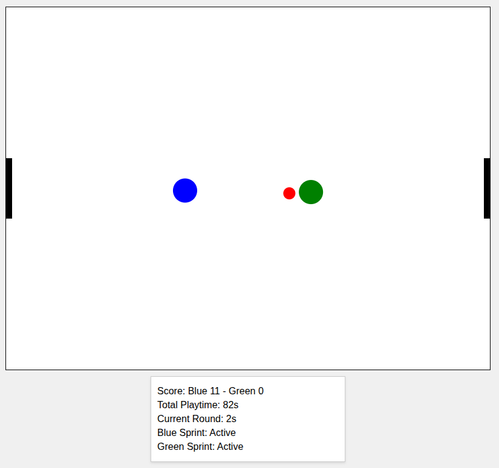

# js_robotballgame

## Play it now: https://pemmyz.github.io/js_robotballgame/

# 🤖⚽ Robot Ball Game

A simple AI-based 2-player robot soccer game built with **JavaScript**. Two robots, Blue and Green, autonomously chase and kick a ball into each other's goals. Includes features like sprinting, collisions, goals, and score tracking!

### Game

---

## 🕹️ Features

- 🧠 **Autonomous AI**: Robots track and chase the ball toward the opponent's goal.
- 💨 **Sprinting**: Robots sprint when they're far from the ball, with cooldowns.
- 🎯 **Kicking Mechanics**: Strategic kicking with trick maneuvers when contesting the ball.
- 🤼 **Robot Collisions**: Bounce and reposition when they collide.
- 🥅 **Goals & Scoreboard**: Automatically resets round after goals.
- ⏱️ **Timers**: Tracks total playtime and time per round.
- 🖥️ **Simple UI**: Score, time, and sprint status displayed on screen.

---
